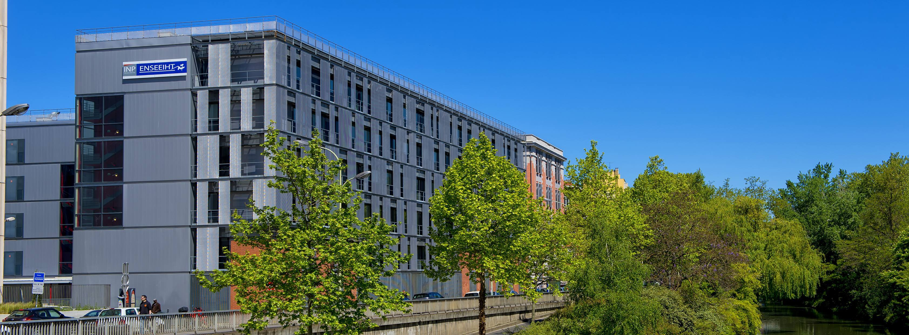

<h1 align="center">

  
   
  

      
      
      
       <!-- matlab logo doesn't exist :(-->
      
      
    

     
  I'm Etienne BARDET
   
  
   
  French Engineering Student @ <a href="https://www.enseeiht.fr">ENSEEIHT</a>
   Specialised in 
  AI and Signal Processing
</h1>

## ❓ Who am I ?

I'm a French Engineering student at Enseeiht in Toulouse, France. I love science and have been particularly interested by astronomy for around 6 years now. I am specialised in Signal Processing and AI. I love to learn about new topics, especially when they are space related. My syllabus includes image processing, keeping me close to my astrophoto hobby. As a student, I use this account mostly to keep track of my coding projects starting from my second year out of three in engineering school. This Engineering diploma is equivalent to a Master in Engineering : it is done in 5 years, 2 in an intensive preparatory course, and 3 in an engineering school. 
  
Check out my LinkedIn here,
 

  

## 💼 Projects I have completed 
Throughout my years at ENSEEIHT, I've had the occasion to work on several projects, whether they are club-related or not.
  

⚙️ Being specialised in Deep Learning, one of my most important project is [Caisen](https://github.com/Etienne-bdt/Caisen). CAdastre Interface SENtinel is an environment monitoring project. Depending on the french Cadastre given two years, it fetches new buildings and builds a dataset of change detection sentinel 2 images to predict the impact of future buildings. Due to computationnal and time constraint the project has been done using CNN and not Diffusion models but remains an area of improvement for our project.  
It has been one of the most complex and rewarding projects, and has mobilized nine students for a few months.   

👁️ Other Projects I am proud of are : [Kmeans segmentation in C](https://github.com/Etienne-bdt/Projet-Image) using OpenCV and [SuperPixel Segmentation in MATLAB](https://github.com/Etienne-bdt/Modelisation)
Both projects aim at teaching us the basis of computer vision using segmentation.  

📡 As a Signal Processing Major, I have had the occasion to work on several labs notably on GPS signals, Inverse problems, Computational Statistics, Deep Learning and such ...
Projects can be found in my repos.

### 🗾 Summer 2024

During the summer of 2024, I had the opportunity to travel to Kyoto, Japan. From june to August, I conducted an internship @ [KUAS](https://www.kuas.ac.jp/en/). This was an invaluable opportunity to strengthen skills I had already acquired at school and learn more about remote sensing and deep learning methods, notably using TensorFlow.

## 💻 Projects I am working on 

###  This Year
Up until September I will be working as an intern @ [ISAE-SUPAERO](https://isae-supaero.fr) in the [DISC](https://www.isae-supaero.fr/fr/recherche/departements/ingenierie-systemes-complexes/groupe-systemes-decisionnels-462/) department.
It focuses on uncertainty mesurement in the Earth Observation field using [Generative AI](https://en.wikipedia.org/wiki/Variational_autoencoder) (the good kind).

### Side projects 
I contribute sporadically on the [Immich](https://github.com/immich-app/immich) repository and got into self-hosting this year.

## 🕐 Upcoming Projects
### 🛤️ Next year ?

This internship might evolve into a PhD opportunity.

## 🐈☕🥐 Skills
ENSEEIHT allowed me to develop those skills particularly
 

## 🤝 Associative work 

One of the biggest projects I've had the occasion to work on is [Churros](https://git.inpt.fr/inp-net/churros) as a member of @inp-net.
With **only basic** HTML/CSS knowledge in september, I am now a full-stack developper on this project, having worked notably on the [shop section](https://git.inpt.fr/inp-net/churros/-/merge_requests/127) of the app !
  
Special skills I developed for this project:
 

  

  
<!--
**Etienne-bdt/Etienne-bdt** is a ✨ _special_ ✨ repository because its `README.md` (this file) appears on your GitHub profile.

Here are some ideas to get you started:

- 🔭 I’m currently working on ...
- 🌱 I’m currently learning ...
- 👯 I’m looking to collaborate on ...
- 🤔 I’m looking for help with ...
- 💬 Ask me about ...
- 📫 How to reach me: ...
- 😄 Pronouns: ...
- ⚡ Fun fact: ...
-->
